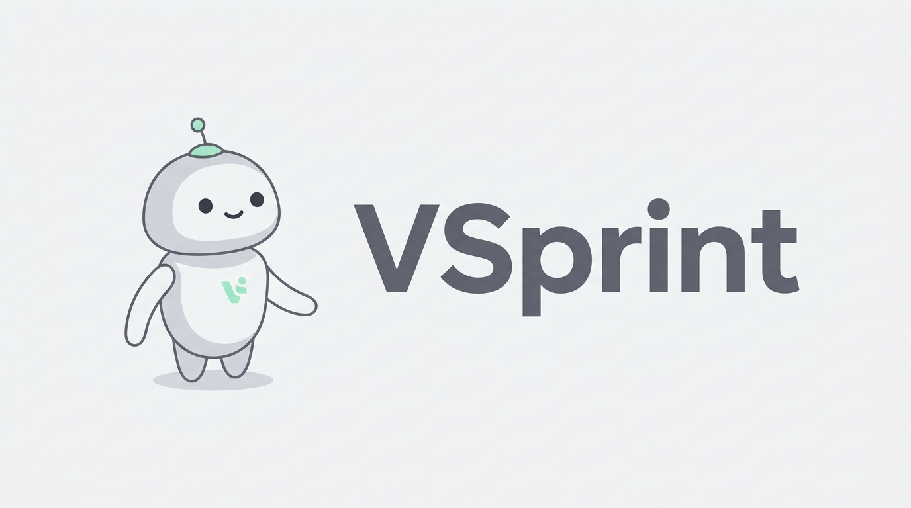
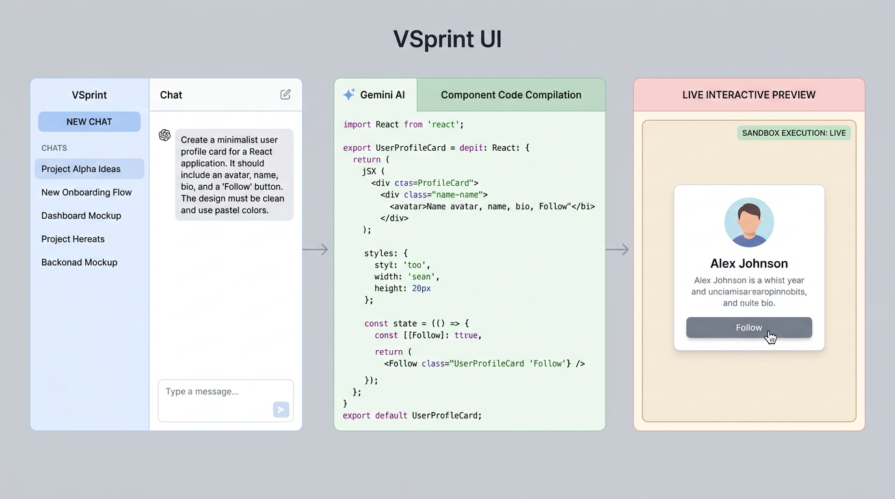

<p align="center">
  
</p>

<p align="center">
  
  
  
</p>

<p align="center">
  <strong>An elite, high-density AI coding coach designed for rapid skill acquisition and real-time interactive component prototyping.</strong>
</p>

---

## ⚡ Quick Start

```bash
git clone https://github.com/christpor/VSprint.git && cd VSprint && npm install && npm run dev
```

<details>
<summary>🔑 Setup Environment Variables</summary>

Create a `.env` file in the root of the project to enable the backend Gemini compiler:

```env
# Backend Gemini Studio API Key
GEMINI_API_KEY="your_api_key_here"

# Application URL
APP_URL="http://localhost:3000"
```

</details>

---

## ✨ Highlights

- ⚡ **Real-Time Sandbox Execution** — Instant sandboxed iframe execution to preview and interact with React components compiled by AI.
- 🤖 **Context-Aware AI Coaching** — System architecture powered by Gemini 2.0 Flash (with 1.5 Pro fallback) specializing in teaching "The Why" behind "The How".
- 🗂️ **Structured Context Routing** — An elite multi-file context system (`context/`) ensuring high stability, preventing hallucinations, and tracing issues.
- 🌙 **Cinematic Vibe System** — Immersive, custom fluid-motion interface designed with Motion 12, Apple-esque aesthetics, and theme synchronization.
- 🔑 **Supabase Authorization Grid** — Integrated Supabase Auth, profiles, and transactional data logging.

---

## 🏗️ System Architecture & Workflow

VSprint compiles custom coding prompts into fully operational sandbox previews, guiding developers with modular senior insights.

<p align="center">
  
</p>

<details>
<summary>📦 Database Schema & Integrations</summary>

The postgres data layer resides on Supabase. To sync the db, apply `supabase_schema.sql` to your Supabase SQL editor:
- `interactions` logs the user prompts, responses, conversation IDs, and status states.
- `profiles` tracks user authorization metadata and custom features (e.g. bonus vibe quotas).

</details>

---

## 🦾 Agent Instructions

This project uses a strict, routing-based AI context architecture. Agents working on this project must initialize by reading `GEMINI.md` and following the sequential routing order specified:

1. **`context/project_overview.md`**: Core mission and user flows.
2. **`context/architecture.md`**: System boundaries and invariants.
3. **`context/code_standards.md`**: Tech rules and styling guides.
4. **`context/workflow_rules.md`**: Action boundaries.
5. **`context/ui_context.md`**: Component styling tokens.
6. **`context/progress_tracker.md`**: Session memory and milestone tracking.

---

## 📄 License

Proprietary License. All rights reserved. Refer to the [LICENSE](file:///home/christ/Vsprint%20first%20ai%20project/LICENSE) file for usage and restriction details.
